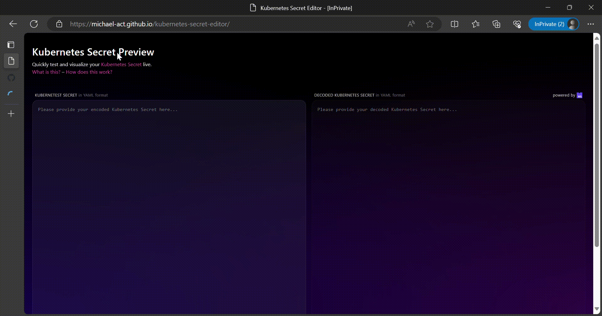

# Kubernetes Secret Editor

<p align="center">
  </img>
</p>

Introducing Kubernetes Secret Editor, the effortless way to edit your Kubernetes secrets directly from your web browser! With the power of web assembly technology, your secret data stays secure, processed entirely on the client side. 
 
### Prerequisites

Make sure you have the following installed on your system:

- [Rancher Desktop](https://rancherdesktop.io/) or [Docker](https://docs.docker.com/engine/install/)

### Setup

1. **Clone the Repository:**
   ```shell
   git clone https://github.com/michael-act/kubernetes-secret-editor/
   cd kubernetes-secret-editor/
   ```

2. **Start the Application:**
   ```shell
   docker compose up -d
   ```

3. Access http://localhost:8000
